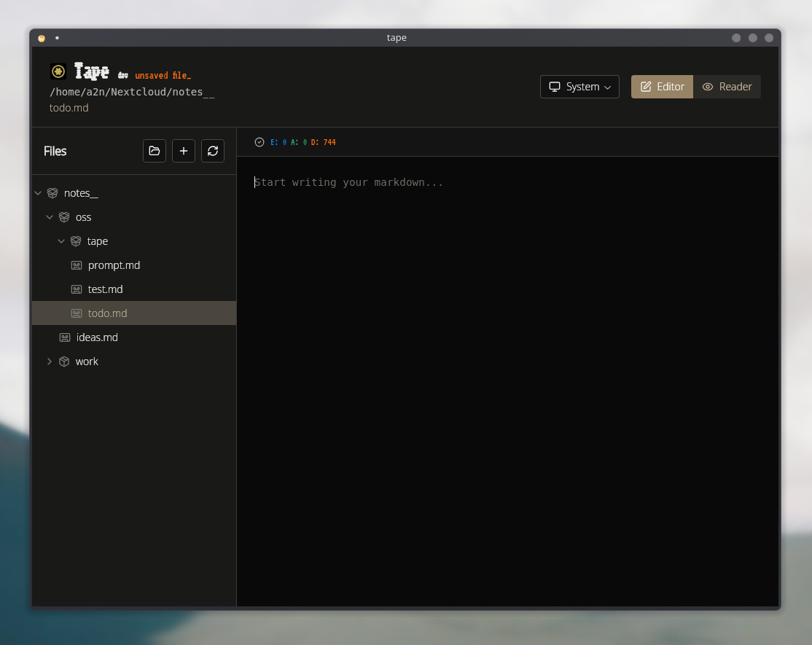

<p align="center">
  <a href="https://github.com/results-may-vary-org/tape">
    
  </a>
</p>
<h1 align="center">Tape - a <i>simple</i> markdown editor</h1>


## Yet another md app?

Tape is designed as a no-bloat markdown editor that focuses on simplicity and efficiency.

I want it to be just what I need it for: taking notes.

No paywall, no outdated ui, no journaling system, simple and plain `.md` files.

## Tape?!?

Yeah `cassette` [is already taken](https://aur.archlinux.org/packages?K=cassette) :) 

[What a tape or a cassette, you may ask.](https://en.wikipedia.org/wiki/Cassette_tape)

The design is inspired by old cassette color, the logo represents the wheel of a cassette.

## Main Features

- **Markdown editor & reader**: Switch between editing and rendered preview modes with live preview `ctrl+tab`
- **File tree**: Organized file browser with folders-first, alphabetical sorting
- **File operations**: Create, rename, delete files and folders with existence validation
- **Save**: `ctrl+s` to save with visual unsaved changes indicators
- **Persistent workspace**: Remembers last opened folder, selection and config via `tape.json` config
- **Context menus**: `right-click` for file and folder operations
- **Full-text search**: `ctrl+k` to search across all markdown files with fuzzy matching
- **Cross-platform**: Available for Linux, Windows, and macOS
- **Full keyboard integration**: You can navigate the ui with `tab` and `shift+tab`, `enter` to open
- **Shortcut help**: just hit `ctrl+h` to get the full list of shortcuts
- **Sync yourself**: because the app handle plain `.md` files and the config file is place at the root of your notes folder, you can sync your notes with any other app you want

### What's coming next?

- ctrl+z working
- auto save
- mcp server

## Installation

### Linux
- Download via [AUR](https://aur.archlinux.org/packages/tape-bin)
- Download the installer from [releases](https://github.com/results-may-vary-org/tape/releases)

### Windows
- Download the installer from [releases](https://github.com/results-may-vary-org/tape/releases)

### macOS
- Download the `.app` bundle from [releases](https://github.com/results-may-vary-org/tape/releases)
- Drag to Applications folder

### Build from Source
```bash
# Prerequisites: Go 1.23+, Node.js, Wails v2.9.0+
git clone https://github.com/results-may-vary-org/tape.git
cd tape
wails build
```

## Configuration `tape.json`

The config is mostly there to remember your last opened folder, selection and view mode.

It must be placed at the root of your notes folder.

```json
{
  "lastOpenedFolder": "path of the last selected root folder",
  "lastOpenedFile": "path of the last selected note",
  "expandedFolders": ["array of each expanded folder"],
  "viewMode": "editor",
  "theme": "light"
}
```

## Code of conduct, license, authors, changelog, contributing

See the following files:
- [license](LICENSE)
- [contributing guidelines](CONTRIBUTING.md)
- [changelog](CHANGELOG.md)
- [code of conduct](CODE_OF_CONDUCT.md)

## Want to participate? Have a bug or a request feature?

Do not hesitate to open a PR or an issue. I reply when I can.

## Want to support my work?

- [Give me a tip](https://ko-fi.com/a2n00)
- [Give a star on GitHub](https://github.com/results-may-vary-org/tape)
- [Report issues or contribute](https://github.com/results-may-vary-org/tape/issues)
- Or just participate in the development :D

### Thanks!
